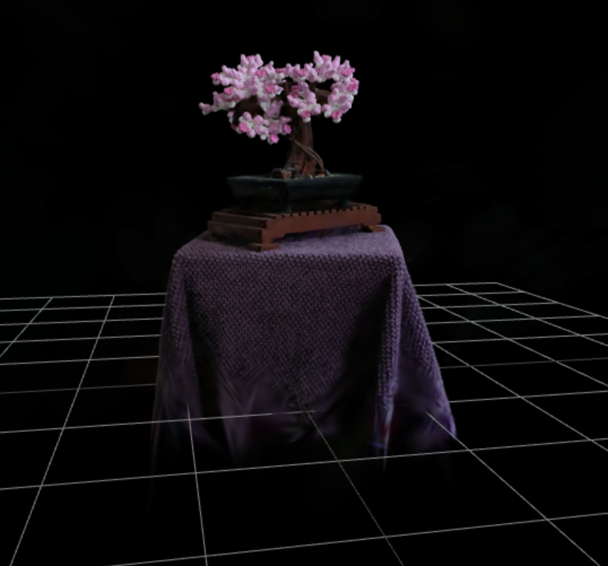

# Gaussian Splat Three Example



## Parcel Bootstrap Project

In this project you'll find an Node.js project that gets you up and running with Gaussian Splats for Three.

## Preview

[GitHub-Pages](https://zappar-xr.github.io/three-gaussian-splat-example/)

## Running the Project

The project has been set up to use parcel for bundling assets and code. To get started, install the project's dependencies by running the following command:

```bash
npm install
```

During development, you can use the following command to run a `parcel` server for testing on your computer or a device on your local network:

```bash
npm run start
```

And when you're ready to publish your site, run the following command. The resulting `dist` folder can be uploaded for publishing.

```bash
npm run build
```
